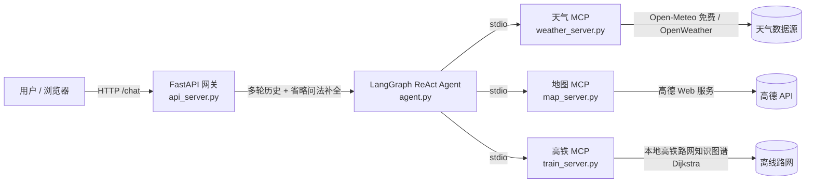

# AI 智能出行助手 · 一个能跑的 Agent 作品

> **一句话定位**：用一句话同时查天气、规划路线、给出高铁方案，由 LLM 自动编排多个工具后综合作答。这是我在「AI PM」视角下从 0 到 1 主导设计、并落地实现的可运行原型——不是教学脚本，是能直接对话的产品。

🌐 **在线 Demo（点开即聊，无需本地环境）**：<https://aigrantrip.app.workbuddy.link>

---

## 为什么做这个（PM 视角）

出行规划的真实场景里，用户的一句「后天从北京去广州出差，看天气和路线」天然跨多个信息源：天气、地图、交通。传统做法是让用户自己开三四个 App 拼。我要解决的就是**把"跨源信息编排"这个问题，用一个对话入口包掉**。

我在这个项目里的角色是**产品定义 + 技术技术双肩挑**：

- **定问题**：把"纯查询"拆成可被 Agent 调用的**原子工具**（天气 / 地图 / 高铁），让 LLM 负责编排而非硬编码流程；
- **定标准**：建立"宽松 100% / 严格可验证"双评测口径，用数据而非感觉判断好坏；
- **做拍板**：哪些能力进 V1、哪些延后到 V2，由我按"用户价值 × 实现成本"拍板；
- **落代码**：架构与工具边界由我定义，核心编排与工具层借助 AI 辅助编程落地（LangGraph + 3 个 MCP 子进程）；我作为技术 owner 端到端主导，能讲清每一处设计取舍。

---

## 产品能力设计

| 能力 | 说明 | 我的设计决策 |
|---|---|---|
| 多工具编排 | 一句话触发天气 + 地图 + 高铁并行查询 | MCP 可插拔 → 能力可横向扩展，加工具不改主流程 |
| 多轮对话 | "那深圳到北京呢？" 能接着上文 | Session 记忆 + 工程兜底（省略问法补全）→ 支撑真实多轮 |
| 严肃模式 | 行程类问题额外做 POI 校验、异常拦截 | 防"误定位 / 离谱耗时"等真实缺陷 |
| 调用可视化 | 前端标注每个回答的工具来源 | 把"黑盒"变成可解释，便于评测与信任 |
| 零 Key 可跑 | 天气默认走 Open-Meteo（免 Key） | 降低体验门槛，地图 Key 缺失时优雅降级 |

---

## 关键成果（口径诚实，可复测）

- **端到端响应时间 7.25s → 约 4.5s（−40%）**：通过 **MCP 子进程复用**（persistent session）实现，3 次重复实测稳定在该区间；提示词瘦身未带来显著延迟收益（已用对照实验证伪）。
- **效果评测双口径**：
  - 宽松口径（规则校验）**30 题能力基线 · 4+1 指标双模型均 100%**（工具选择 30/30、任务完成 30/30、参数提取 22/22、无效调用 0/30、澄清 4/4）；
  - 严格口径（LLM 作为裁判，DeepSeek **96.7%** / 通义千问 **90.0%**）同步披露，不挑好看的数字报。
- 缺陷防回归：地图 POI 误定位、多轮省略问法、参数空值等已修复并沉淀为内部端到端回归用例。

---

## 技术架构（真实可考）



| 层 | 文件 | 职责 |
|---|---|---|
| 网关 | `api_server.py` | FastAPI，暴露 `/chat`/`/health`/`/`，内置多轮 `session` 与「省略问法补全」工程兜底 |
| 编排 | `agent.py` | LangGraph `create_react_agent`，连接 3 个 MCP 服务，LLM 可切换 DeepSeek / 通义千问 |
| 工具·天气 | `weather_server.py` | `query_weather`，双源：Open-Meteo（默认，免费免 Key）/ OpenWeather |
| 工具·地图 | `map_server.py` | `maps_search` / `maps_direction`，封装高德开放平台 |
| 工具·高铁 | `train_server.py` | `query_train`，内置已核实的中国高铁站 + 干线路网，Dijkstra 算最少换乘 |
| 前端 | `static/index.html` | 对话 UI，按工具类型标注来源并展示调用步骤 |

**技术栈**：Python 3.11 · LangGraph · langchain-mcp-adapters · FastMCP · FastAPI · uvicorn

---

## 本地运行（Quick Start）

> 标准 Python 项目，无私有依赖，Windows / macOS / Linux 均可。

```bash
python3.11 -m venv .venv
source .venv/bin/activate          # Windows: .venv\Scripts\activate
pip install -r requirements.txt
cp .env.example .env               # 至少填 DEEPSEEK_API_KEY
PORT=8000 python api_server.py     # 浏览器打开 http://localhost:8000
```

零成本试跑：天气 / 高铁无需任何 Key；地图才需高德 Key（缺失时优雅降级）。
详细配置、接口、Docker 部署与故障排查见下方附录。

---

## 已知限制（诚实声明）

- **高铁为离线知识图谱**：12306 实时车次 / 票价 / 余票接口对云服务器 IP 有反爬风控，沙箱内无法稳定联网查实时车次。`query_train` 返回"线路参考"（换乘站点、大致历时、所属干线），实时信息以 12306 为准；路网数据已联网核实（含新建车站）。
- **地图依赖高德 Key**：未配置时地图工具不可用，天气、高铁不受影响。
- **跨国出行**：海外城市高铁 / 驾车不适用，工具会提示"需乘飞机"（尚未接入航班查询）。
- **线上分享链接偶发不可达**：发布平台无保活机制，沙箱休眠时链接短暂不可达；本机 `http://localhost:8000` 常驻最稳。

---

## 附录

### 配置说明（`.env`）

| 变量 | 必填 | 说明 |
|---|---|---|
| `LLM_PROVIDER` | 否 | `deepseek`（默认）或 `qwen` |
| `DEEPSEEK_API_KEY` | 是* | `LLM_PROVIDER=deepseek` 时必需 |
| `DEEPSEEK_MODEL` | 否 | 默认 `deepseek-chat` |
| `DASHSCOPE_API_KEY` | 是* | `LLM_PROVIDER=qwen` 时必需 |
| `AMAP_KEY` | 地图 | 高德 Web 服务 Key；缺省时地图工具返回"未配置"提示 |
| `WEATHER_PROVIDER` | 否 | `open_meteo`（默认，免费免 Key）或 `openweather` |

`*` 两个 LLM Key 至少填一个。

### 接口

- `POST /chat`：`{ "question": "...", "session_id": "可选" }` → 返回综合回答 + 工具调用步骤
- `GET /health`：`{ "status": "ok" }`

### Docker 自托管

```bash
docker build -t travel-agent .
docker run -d --name travel-agent -p 8000:8000 --env-file .env travel-agent
curl http://<服务器IP>:8000/health
```

---

*本仓库为作品展示用途，保留产品方案摘要（`docs/产品方案摘要.html`）供对照阅读。*
